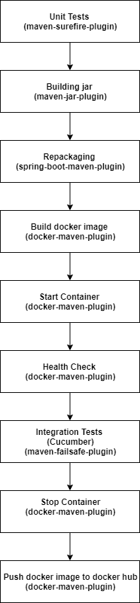

# sample-docker-app

A sample spring boot application which uses **docker-maven-plugin** (from [fabric8](http://maven.fabric8.io/)) to build and push its docker image.

This application executes following phases as part of maven verify:

 
 
 **Note:** This application currently uses docker hub as docker registry. We can also use private registries such as AWS ECR to push docker images.
 
 To use AWS ECR, make following changes in the **pom.xml**:
 
 1. Add a registry tag, such as : **\<registry>12345678.dkr.ecr.eu-west-1.amazonaws.com\</registry>** inside the **configuration** tag of **docker-maven-plugin** 
 2. Change the name tag value inside the **configuration** tag to: **\<name>12345678.dkr.ecr.eu-west-1.amazonaws.com/sample-docker-app:${project.version}\</name>** 
